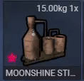

## ⚠️ Notice

This version of `ox_inventory` has been modified to ensure **broad framework compatibility**, now working seamlessly with **qb-core**, **qbox**, **esx**, **ox_core**, and **nd_core**.

It began as a continuation of an older fork that reintroduced QB support but is no longer available. Since then, this fork has grown into a **community-focused project** that prioritizes compatibility while introducing small, non-intrusive quality-of-life improvements.

**Important:**
The original `ox_inventory` was created by the **Overextended** team and remains under its original license. It is **no longer actively maintained** by them, and this fork is **not officially supported** by Overextended.
Please do **not contact them** for issues related to this version.

---

### Purpose

The goal of this fork is to provide a **collaborative, framework-inclusive solution** for the FiveM community. We believe in open-source software that adapts with community input, encouraging innovation and evolution through collective development.

---

## Key Differences from Other Forks

### Framework Compatibility

* Full support for **qb-core** (latest versions).
* Preserves complete functionality for **esx**, **ox_core**, **qbox**, and **nd_core**.
* No framework-specific features are lost — everything continues to work across supported frameworks.

---

### Rarity Indicators (Optional Visual Feature)



* Items can now display a **star icon** in the bottom-left corner based on a `"rarity"` metadata key.
* **Color-Based Rarities**: `common`, `uncommon`, `rare`, `epic`, `legendary`, `artifact`, `red`, `pink`, `gold`, `rainbow`, `silver`, `bronze`, `copper`, `blue`, `green`, `cyan`, `magenta`, `yellow`, `orange`, `purple`, `lime`, `teal`, `indigo`, `violet`, `maroon`, `navy`, `olive`, `aqua`, `fuchsia`, `black`, `white`, `crimson`, `turquoise`, `lavender`, `rose`
* The `rainbow` rarity features a special animated color-cycling effect.
* **Default Rarity Support**: define rarities directly in `data/items.lua` or `data/weapons.lua` for automatic application.
* Can also be overridden at runtime when adding items.

#### Usage Examples:
```lua
-- In data/items.lua
['rare_gem'] = {
    label = 'Rare Gem',
    weight = 50,
    rarity = 'rare',  -- Will automatically show blue star
}

-- In data/weapons.lua (inside Weapons table)
['WEAPON_LEGENDARY_PISTOL'] = {
    label = 'Legendary Pistol',
    weight = 1200,
    durability = 0.2,
    ammoname = 'ammo-9',
    rarity = 'legendary',  -- Will automatically show orange star
}

-- Runtime metadata override
exports.ox_inventory:AddItem(playerId, 'item_name', 1, {
    rarity = 'epic'  -- Overrides default rarity or sets one
})
```

### Additional Enhancements

* **Extra image formats** supported: `.jpg`, `.jpeg`, `.gif`.
* **More hosting sources allowed**, including **img.bb** and **Discord CDN**.

These additions simplify image use for icons and embedded content without extra setup.

# ox_inventory

A complete inventory system for FiveM, implementing items, weapons, shops, and more without any strict framework dependency.


## 📚 Documentation

https://coxdocs.dev/ox_inventory

## 💾 Download

https://github.com/TheOrderFivem/ox_inventory/releases/latest/download/ox_inventory.zip

## 📺 Install Guide
https://www.youtube.com/watch?v=g1_ryUZSOGA

## Supported frameworks

We do not guarantee compatibility or support for third-party resources.

- [qb-core](https://github.com/qbcore-framework/qb-core)
- [esx](https://github.com/esx-framework/esx_core)
- [qbox](https://github.com/Qbox-project/qbx_core)
- [ox_core](https://github.com/communityox/ox_core)
- [nd_core](https://github.com/ND-Framework/ND_Core)

## ✨ Features

- Server-side security ensures interactions with items, shops, and stashes are all validated.
- Logging for important events, such as purchases, item movement, and item creation or removal.
- Supports player-owned vehicles, licenses, and group systems implemented by frameworks.
- Fully synchronised, allowing multiple players to [access the same inventory](https://user-images.githubusercontent.com/65407488/230926091-c0033732-d293-48c9-9d62-6f6ae0a8a488.mp4).

### Items

- Inventory items are stored per-slot, with customisable metadata to support item uniqueness.
- Overrides default weapon-system with weapons as items.
- Weapon attachments and ammo system, including special ammo types.
- Durability, allowing items to be depleted or removed overtime.
- Internal item system provides secure and easy handling for item use effects.
- Compatibility with 3rd party framework item registration.

### Shops

- Restricted access based on groups and licenses.
- Support different currency for items (black money, poker chips, etc).

### Stashes

- Personal stashes, linking a stash with a specific identifier or creating per-player instances.
- Restricted access based on groups.
- Registration of new stashes from any resource.
- Containers allow access to stashes when using an item, like a paperbag or backpack.
- Access gloveboxes and trunks for any vehicle.
- Random item generation inside dumpsters and unowned vehicles.

## Copyright

Copyright © 2024 Overextended <https://github.com/overextended>

This program is free software: you can redistribute it and/or modify it under the terms of the GNU General Public License as published by the Free Software Foundation, either version 3 of the License, or (at your option) any later version.

This program is distributed in the hope that it will be useful, but WITHOUT ANY WARRANTY; without even the implied warranty of MERCHANTABILITY or FITNESS FOR A PARTICULAR PURPOSE. See the GNU General Public License for more details.

You should have received a copy of the GNU General Public License along with this program. If not, see <https://www.gnu.org/licenses/>.
